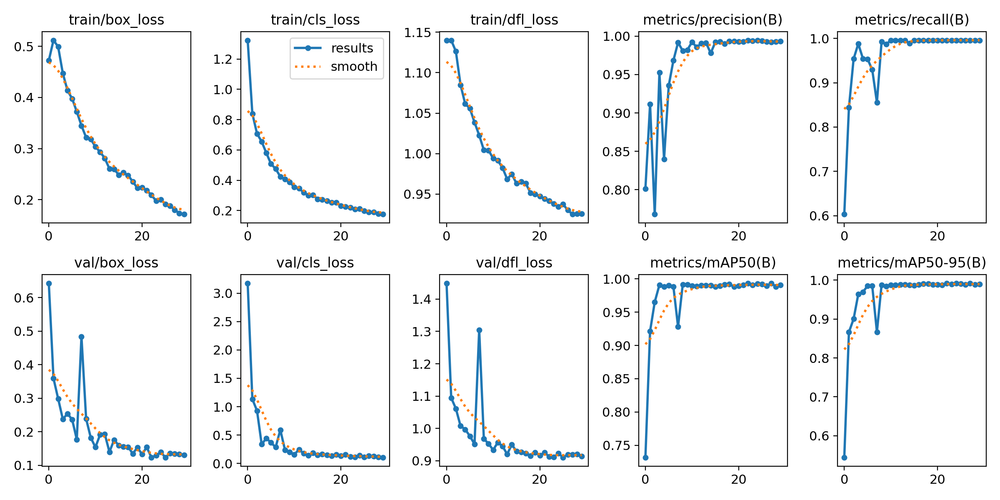
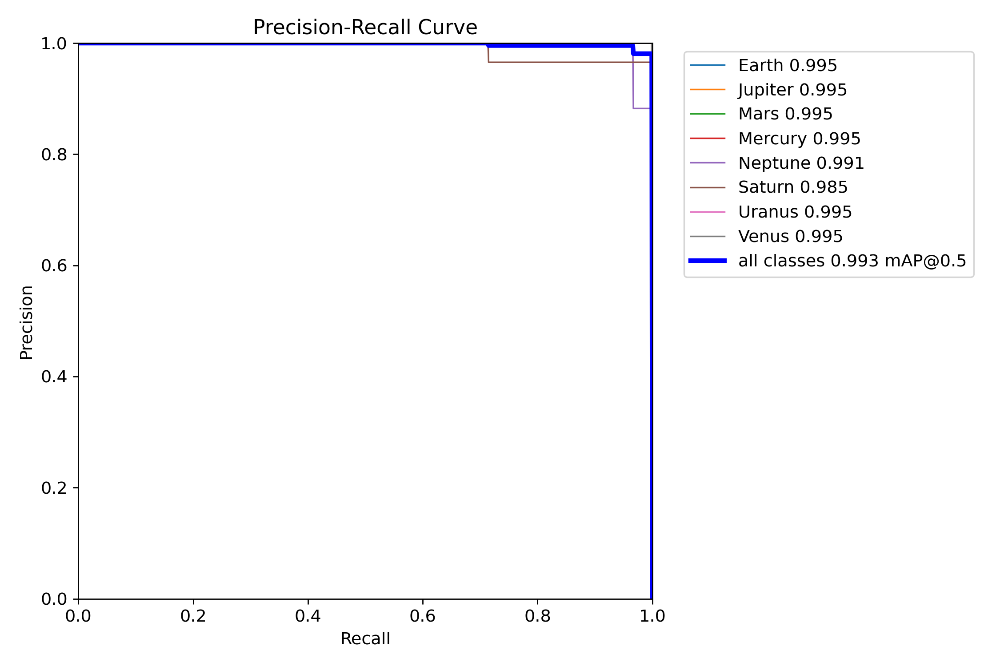
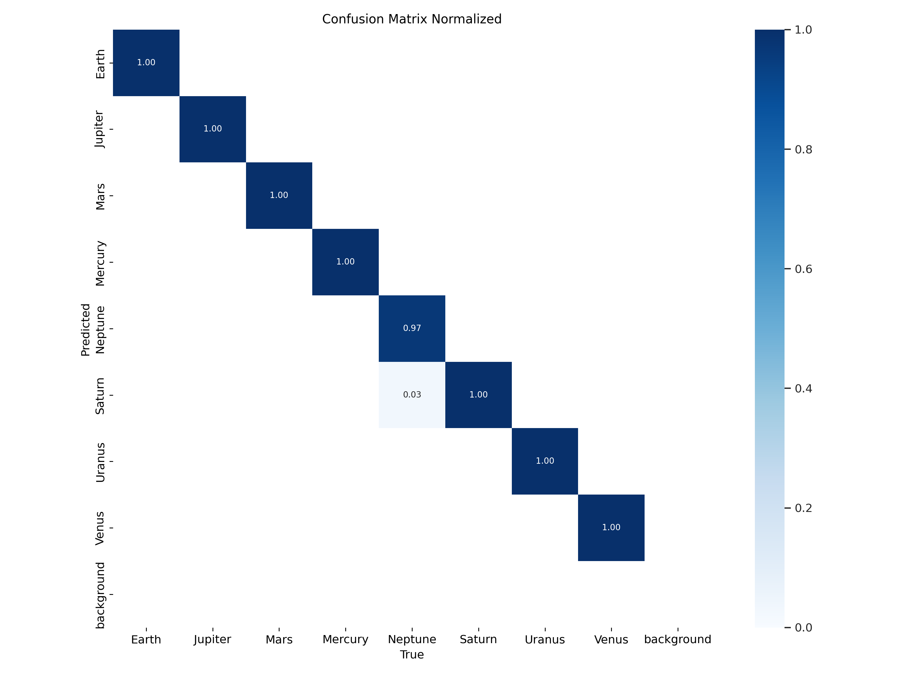

# Planets Detection

## Dataset: 
### The dataset is composed of 2 folders:
- train: 2497 images
- validation: 232 images
- test: 128

### The dataset contains 8 classes:
- Earth
- Jupiter
- Mercury
- Neptune
- Saturn
- Uranus
- Venus

### Model:
- YOLOv8

### Training:
- 30 epochs
- Batch size: 16
  

### Results:

#### Loss:

 

#### PR Curve:

 

#### Confusion Matrix:

 

#### Predictions:

## Deployment:
### The model is deployed on Streamlit.